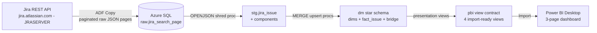
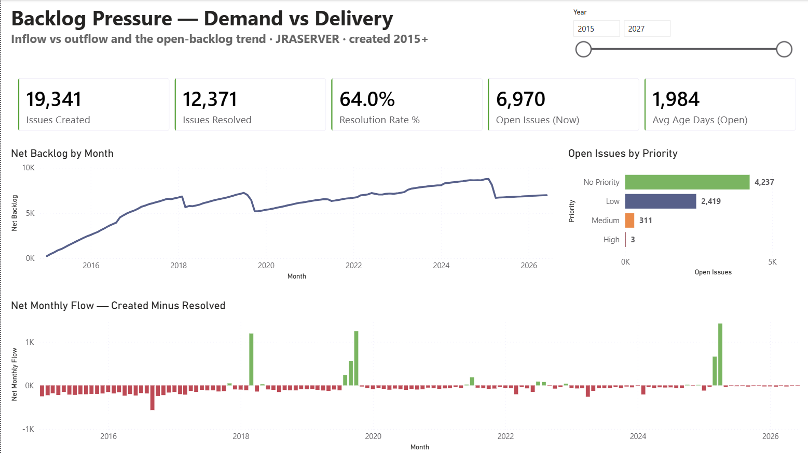
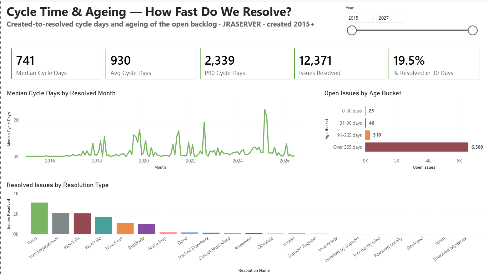
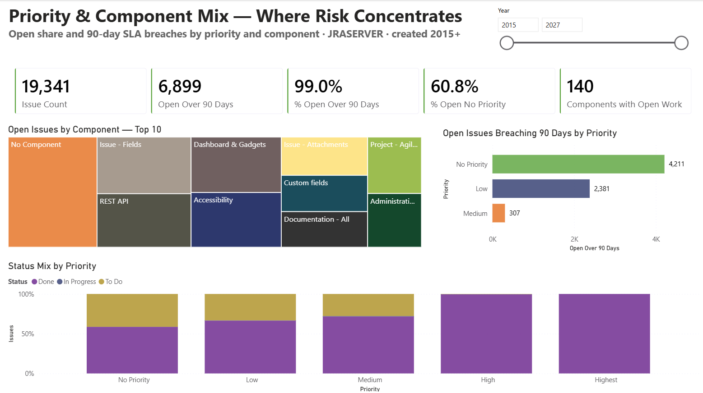

# analytics-tsql-adf-project

> Delivery / ticket-ops analytics mini-project — real Jira issue data → Azure Data Factory →
> Azure SQL raw JSON → T-SQL star schema (OPENJSON / MERGE / views) → 3-page Power BI
> dashboard. Mini-project #2 of Phil's data engineering portfolio.

**Status: COMPLETE — 2026-06-12.** End-to-end and interview-ready: paginated REST ingestion
(ADF Copy, raw JSON pages, no flattening) → T-SQL shred and star-schema model (OPENJSON,
stored procedures, MERGE upserts, TRY/CATCH) → presentation-view contract layer → 3-page
Power BI report with 25 documented DAX measures. Full build history, design decisions and
the risk log live in `PROJECT_CONTEXT.md`.

## What this project demonstrates

- **T-SQL depth (the lead theme)** — OPENJSON shredding with explicit schemas, timestamp
  repair, set-based dedupe, MERGE upserts with doc-verified guardrails (HOLDLOCK, key-only
  ON, change-only updates), TRY/CATCH + THROW + XACT_ABORT conventions
- **ADF as a thin courier** — Copy activity with native RANGE/EndCondition pagination over
  a REST source; all transformation logic lives in version-controlled SQL, not pipelines
- **Raw-first landing zone** — page-grain JSON staged verbatim as NVARCHAR(MAX); the
  landing zone stores what arrived, including the pagination stop-probe row
- **Star schema modelling** — conformed dims, fact at issue grain, many-to-many component
  bridge, surrogate-keyed role-playing date dimension
- **MERGE upsert story** — a second snapshot pull exercised the change-gate honestly:
  2 inserts / 5 updates, unchanged rows kept their original audit labels
- **Presentation-view contract layer** — one Power Query query = one view, zero PQ
  transforms; consumer labels and refresh-time ageing computed in SQL (Roche's maxim)
- **Verification suites** — every phase ships a single PASS/FAIL grid (parity, grain,
  audit-label integrity, cross-view consistency) run before anything is called done
- **Documented DAX** — 25 measures incl. classic time intelligence, USERELATIONSHIP
  role-playing date variants, cumulative VAR patterns, and DISTINCTCOUNT-grain discipline
  over the bridge fan-out

## Architecture



## Stack

| Layer | Choice |
|---|---|
| Cloud | Azure (Australia East) |
| Ingestion | Azure Data Factory V2 — Copy activity only, native REST pagination |
| Database | Azure SQL Database (free offer, serverless auto-pause) |
| Transformation | T-SQL — OPENJSON shred, MERGE upserts, stored procedures, views |
| Modeling | Star schema (conformed dims, issue-grain fact, component bridge) |
| BI | Power BI Desktop, Import mode .pbix |

## Data source

Atlassian's public Jira instance at jira.atlassian.com, queried anonymously via the REST
search endpoint (audit re-verified live 2026-06-10: 51,783 JRASERVER issues, 500/page
pagination honoured). Extract window locked to issues created 2015-01-01 onward — 19,339
issues pulled as a frozen snapshot, with one later re-run to exercise the MERGE upsert path
(19,341 after).

**Data provenance / PII note:** this is real public issue-tracker data containing real
reporter and assignee names. Raw JSON is never committed to this repository; person fields
are excluded from the model, and free-text summaries were dropped (PII surface, no
dashboard use).

## Project structure

```
analytics-tsql-adf-project/
├── adf/                          # exported ADF definitions (sanitised, no secrets)
│   ├── linkedService/            # REST source + Azure SQL sink
│   ├── dataset/                  # paginated search source + staging sink
│   └── pipeline/                 # pl_ingest_jira_snapshot — Copy w/ RANGE pagination
├── sql/
│   ├── ddl/                      # 01 raw staging · 02 star schema · 03 pbi views
│   ├── proc/                     # 01 OPENJSON shred · 02 dim MERGEs · 03 fact MERGE
│   └── verify/                   # per-phase PASS/FAIL verification suites
├── pbi/
│   ├── jira_ticket_ops_analytics.pbix
│   └── screenshots/              # one per report page
├── INGESTION_PIPELINE.md         # walkthrough: ADF ingestion + pagination story
├── TSQL_MODEL.md                 # walkthrough: shred, star schema, MERGE, views
└── PROJECT_PLAN.md / PROJECT_CONTEXT.md / ENGINEERING_STANDARDS.md
```

## How this project was built

This project was built using AI-assisted pair programming (Claude by Anthropic).
All architecture decisions, technology selections, and final design choices are
my own; the AI accelerated implementation and acted as a senior-DE code reviewer.
The intent of the project is portfolio learning — every component was built with
explicit understanding of what it does and why. Walkthrough docs are
`INGESTION_PIPELINE.md` and `TSQL_MODEL.md` at repo root; decision records and
the build log are captured in `PROJECT_CONTEXT.md`.

## Project documents

- [`PROJECT_PLAN.md`](PROJECT_PLAN.md) — locked scope, pipeline, phase breakdown, risks
- [`PROJECT_CONTEXT.md`](PROJECT_CONTEXT.md) — session log, decisions, phase closeouts
- [`INGESTION_PIPELINE.md`](INGESTION_PIPELINE.md) — ADF ingestion walkthrough
- [`TSQL_MODEL.md`](TSQL_MODEL.md) — T-SQL shred / star schema / MERGE walkthrough
- [`ENGINEERING_STANDARDS.md`](ENGINEERING_STANDARDS.md) — the 10-criteria audit applied to every script

## Dashboard

Three pages on an Import-mode semantic model: four presentation views, five hand-built
relationships (created-date active, resolved-date inactive via USERELATIONSHIP), a marked
date table, and 25 documented measures on a hidden `_Measures` table.

### Backlog Pressure — Demand vs Delivery



Inflow vs outflow and the net-backlog trend. Headline finding: the open backlog is
dominated by **No Priority** issues — untriaged work, not urgent work. The diverging
Net Monthly Flow bars expose rare catch-up months against a decade of net growth.

### Cycle Time & Ageing — How Fast Do We Resolve?



Created-to-resolved cycle distribution (median 741 days, P90 2,339) and ageing of the open
backlog (Over-365-days dominates). Only **19.5% of closures land within 30 days**. The
March 2025 median spike is a bulk cleanup sweep — 724 resolutions in one month (~8x normal)
at a 2,580-day median, visible in the trend tooltip.

### Priority & Component Mix — Where Risk Concentrates



Where the open backlog concentrates and what breaches a 90-day SLA lens: **99.0% of open
issues are over 90 days old**, the breach pile is entirely untriaged/low-priority work,
and open work spans 140 components.

## Related projects

Part of Phil's data-engineering portfolio:

- **Project #1 — [cdc-nt-gtfs-project](https://github.com/Pheluciam/cdc-nt-gtfs-project)** — dbt-first pipeline on PostgreSQL → Power BI; Kimball modelling foundation.
- **Project #2 — [retail-demand-forecasting-project](https://github.com/Pheluciam/retail-demand-forecasting-project)** — cloud warehouse + orchestration: Azure SQL → Snowflake → Airflow (Docker) → dbt → Power BI, with a Cortex forecast layer.
- **Project #3 — [financial-analytics-lakehouse-project](https://github.com/Pheluciam/financial-analytics-lakehouse-project)** — AWS-native lakehouse: S3 + Glue + Athena + Iceberg, dbt-athena, Step Functions, 6-page Power BI, keyless OIDC CI/CD.
- **Mini #1 — [operations-analytics-dbt-tableau-project](https://github.com/Pheluciam/operations-analytics-dbt-tableau-project)** — dbt testing + macros depth on the AdventureWorks distribution slice; PostgreSQL → dbt → Tableau Public.
- **Mini #2 — analytics-tsql-adf-project** *(this one)* — Jira REST → ADF → Azure SQL → T-SQL star schema → Power BI; lead theme T-SQL depth.

## Author

Phil McKechnie — Business Intelligence Analyst & Developer, Melbourne. 15+ years across
operations, supply chain and analytics; the last 5 in dedicated BI roles (SQL, Tableau,
Power BI). Building a data-engineering portfolio across dbt, cloud warehouses and
AWS-native lakehouse work.
